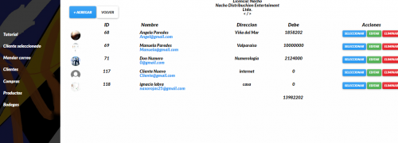

# Crud práctica

Manejo de stock en bodegas, ingreso de clientes, ingreso de compras por cliente registrado, envió de correo. 

## Herramientas

- PHP 7
- MySql
- Bootstrap
- Jquery
- Ajax
- Css3
- Manejo de cokies

## Demo
https://nacholabraweb.000webhostapp.com/Crud

## Autor
Ignacio Labra
